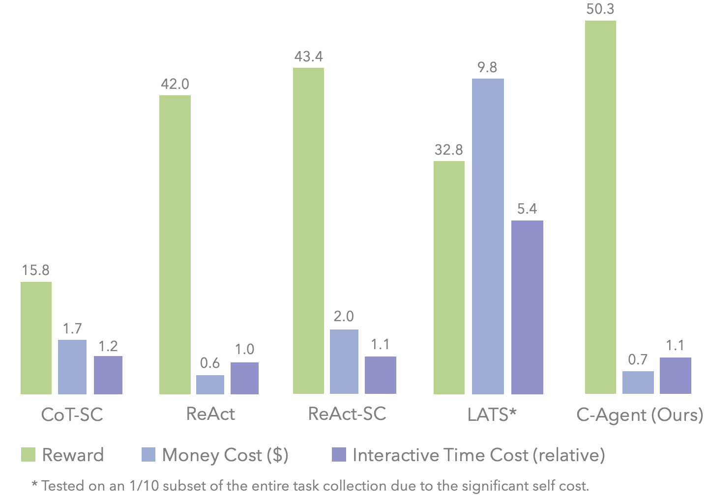
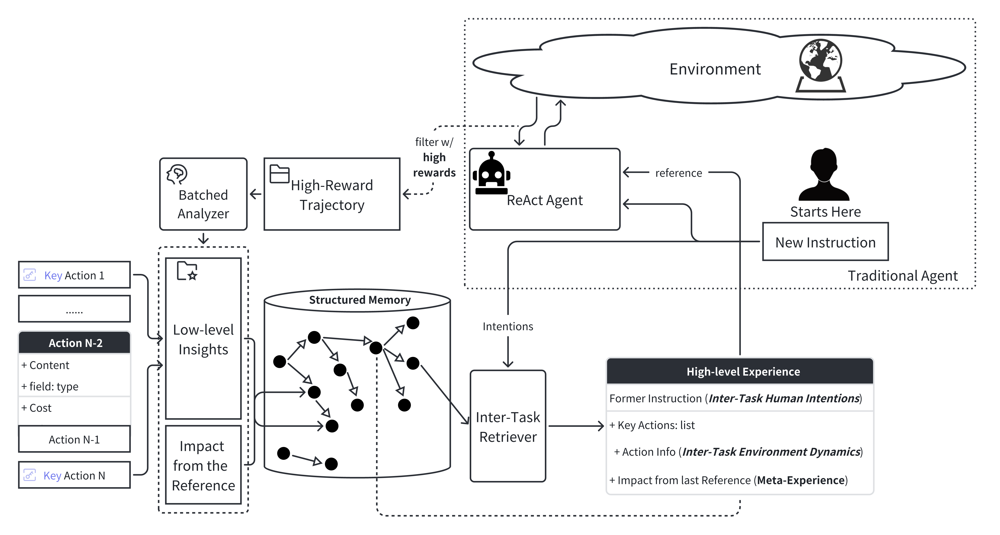

# Agents under **U**nified **A**lignment for **A**gents (**UA**$^2$) Framework


> 🚀 This repo implements the preliminary version of agents designed under **U**nified **A**lignment for **A**gents (**UA**$^2$) framework with results benchmarked on [**UA**$^2$-Webshop](https://github.com/AgentForceTeamOfficial/**UA**$^2$-Webshop).  
> 🚀 The project is a practice of LLM-powered agent framework design under the guidance of [*Towards Unified Alignment Between Agents, Humans, and Environment*](https://agent-force.github.io/unified-alignment-for-agents.html).


## Performance Comparison on **UA**$^2$-Webshop


<details><summary>Caption</summary>
The performance of averaged reward, success rate (SR) (%), alignment gap (%) with human intentions (G_{HI}) and environment dynamics (G_{ED}), time (s) and money ($) cost of all methods tested in our retrofitted WebShop environment. The best result for each metric is in <b>bold</b>. The better performance under each metric is indicated by the darker <font color="green">green</font> shades. *LATS is tested on 1/10 subset of the
entire task instructions due to the significant cost.
</details>

$$$$

🎡 **Methods used for comparison**:

<!-- - [**CoT-SC**](https://arxiv.org/abs/2203.11171): Sampling diverse [Chain-of-Thought reasoning](https://arxiv.org/abs/2201.11903) paths and action candidates, and voting for the majority to enhance self-consistency. -->
- [**ReAct**](https://arxiv.org/abs/2210.03629): On each step, the agent decides whether to take actions or reason about the query based on the current state.
- [**ReACT-SC**](https://arxiv.org/abs/2203.11171): Instead of Chain-of-Thought reasoning, we apply self-consistency strategy to ReAct to further improve the performance.
- [**Reflexion**](https://arxiv.org/abs/2303.11366): Using verbal feedback as the reflecion signal for agents. In this case, we follow the external reward as the feedback directly from the environment, following its original setting.  
- [**LATS**](https://arxiv.org/abs/2310.04406): An advanced method that unifies ReAct, self-reflection, and tree search based planning. We adapt the original implementation in our scenario for comparison.
- **Ours**: the **UA**$^2$-Agent framework, which is introduced in the below section.

## Introduction

### 🌐 **UA**$^2$-Webshop

To be specific, the key contribution of our **UA**$^2$ principles to the LLM-powered agent research community is the concept of **alignment** rooted in the agent-assisting process. In **UA**$^2$-Webshop, the requirements of alignment originates from different sources. To name a few:
  - **Human Intentions** (HI): Whether the authentic goals need to be inferred during task execution, or the intentions of humans are precisely conveyed in the descriptions.
  - **Environmental Dynamics** (ED): Whether the state transitions of the environment are intrinsically endowed with partial observability, temporality, or stochasticity.
  - **Self-Constraints**: Whether the status of budgetary resources is reflected, including time consumption, the maximum number of actions or reasoning steps, etc.
    
Kindly refer to the online [article](https://agent-force.github.io/unified-alignment-for-agents.html) for detailed depiction on how we introduce those requirements. The live site demo can be found [here](http://49.232.144.86:5000/), as well as the environment [repo](https://github.com/AgentForceTeamOfficial/C-Webshop) for local deployment purpose.

These requirements are already reflected by the task and the website design of **UA**$^2$-Webshop. In this repo, we wrap the environment with runtime information (time and money) to compute the resource consumptions of an LLM-powered agent.

### 🤖 **UA**$^2$-Agent Framework

The key challenge is to build an agent framework that manages to assist the decision process in a realistic environment, in consideration of different principles of alignment. We leverage a structured memory with low-level insights to make better decisions upon ReACT agents. 


<details><summary>Caption</summary>
The details of our agent design that follows the principles of <b>UA</b>^{2}. Compared to traditional ReACT agents, we append structured experience as the long-term memory: By filtering and analyzing raw trajectories, we extracted key actions from prior successes as low-level insights in reasoning/action paths. By retrieving reference low-level insights under the same user, we can find the high-level experience under most similar user instructions, expressing similar human intentions. Agents are able to understand human intentions and environment dynamics by extrapolating key actions from a similar, prior task.
</details>

$$$$

*Low-level* action insights are a list of key actions solicited
from different runs in the environment under the same task
instruction. The key actions are extracted from the high-reward trajectories with an analyzer, with which the contributions of actions are computed in the task-solving process. 

💡 Here are the ways we follow the **UA**$^2$ principles:

- **Human Intentions**: quickly adapting to the user's preference by retrieving trajectories with high rewards beforehand as the high-level experience. Note that the structured memory only stores the experience of the same user. 
- **Environment Dynamics**: directly transfer the key actions as short-cuts in interaction / reasoning process that lead to the success under ever-changing environment. 
- **Self-Constraints**: retrieving the trajectory of the most similar instruction before as a reference from structured memory. The agent directlly extrapolating the experience, instead of planning from scratch with LLMs or searching in huge memory / experience space.

**Two major modules**:

- *Analyzer* part:

  - Infer the impact of the reference retrieved from the structured *Memory* to better complete the current task
  - Recognize key actions of the current trajectory via reflection in a single LLM call

- *Memory* part:

  - Experimence accumulation with a specific user
  - Structured representation for instruction relations: references points to the actual trajectory of a task 
  - Using semantic similarities for inter-task retrieval
  - Direct action extrapolation from the key action list

    *(For better efficiency, we only utilize the best matched profile as a reference in decision making)*

## What is the function of different directories?

- `./ua2-agent`: the core of our ****UA**$^2$-Agent** framework
  - `Insight.py`: the implementation of *Analyzer* part
  - `Profiler.py`: the implementation of *Memory* part
  - `react_w_insights_w_profiler_v1benchmark.py`: the implementation of our **UA**$^2$-Agent algorithm on **UA**$^2$-Webshop benchmark

- `./environments`: running environment of our **UA**$^2$-Webshop benchmark (the encapsulation of our core environment)
  - `env_instr_list_ua2webshop_runtime_session.py`: the capsule of run-time environment leveraging cost information for **UA**$^2$-Webshop benchmark

- `./baselines`: source code of baselines
  - `README.md`: the instruction of how to run baselines and implementation details

## How to replicate experiments of baselines and ours?

Prepare for the conda environment:
```sh
conda create -n ua2
pip install -r requirements.txt
conda activate ua2
```

Add your OpenAI API key to your environment:
```sh
# on Linux/Mac
export OPENAI_API_KEY=<YOUR_API_KEY>
```

```powershell
# on Windows
set OPENAI_API_KEY=<YOUR_API_KEY>
```

For Reflexion, ReAct-series and CoT-series baselines, change your working directory and run the corresponding script directly:
```sh
cd baselines
python cot_least_to_most.py
python cot_sc.py
python react.py
python react_sc.py
```
For LATS baselines:
```sh
cd baselines/lats
mkdir runtime_logs
./lats.sh
```

For Reflexion:
```sh
cd baselines/reflexion
./reflexion.sh
```

To test our method:
```sh
cd code
python react_w_insights_w_profiler_v1benchmark.py
```

After running the script, the results can be found in the directory `./runtime_logs`. More details can be found in `./baselines/README.md`.

## Authors

<div>
    <span style="vertical-align: middle">The **UA**$^2$-Agent project is a collaborative effort of</span>  <span style="vertical-align: middle"><b>AgentForce Team</b>. The method design, implementation and the testing of baseline methods in the context of the <a href="https://github.com/AgentForceTeamOfficial/**UA**$^2$-Webshop">**UA**$^2$-Webshop</a> is initiated and co-led by <a href="https://www.linkedin.com/in/%E5%AD%90%E5%90%9B-%E5%88%98-164596263/">Zijun Liu</a> (<a href="mailto: liuzijun20@mails.tsinghua.edu.cn">liuzijun20@mails.tsinghua.edu.cn</a>) and <a href="https://github.com/xxmlala">An Liu</a> (<a href="mailto: la22@mails.tsinghua.edu.cn">la22@mails.tsinghua.edu.cn</a>). The following members are listed with main contributions:</span> 
</div>

- [An Liu](https://github.com/xxmlala) developed the **UA**$^2$ Agent, conducted thorough experiments, implemented baselines and data visualization.
- [Zijun Liu](https://www.linkedin.cn/incareer/in/%E5%AD%90%E5%90%9B-%E5%88%98-164596263) developed the **UA**$^2$ Agent, refined the conceptualization of the **UA**$^2$-Agent Framework, and conducted thorough experiments.
- [Kaiming Liu](https://github.com/KMing-L) developed the runtime environment and the **UA**$^2$ Agent, as well as calibrating the presentation of performances of different baseline methods.
- [Zeyuan Yang](https://github.com/MiicheYang) and [Zonghan Yang](https://minicheshire.github.io) contributed to the initial version of the runtime environment wrapper.
- [Zonghan Yang](https://minicheshire.github.io) was also in charge of the final version of data visualization.
- [Zhicheng Guo](https://github.com/zhichengg), [Qingyuan Hu](https://github.com/HQY188), [Kaiming Liu](https://github.com/KMing-L), [An Liu](https://github.com/xxmlala), [Zijun Liu](https://www.linkedin.cn/incareer/in/%E5%AD%90%E5%90%9B-%E5%88%98-164596263), and [Zonghan Yang](https://minicheshire.github.io) collaborated on the implementation of the baseline methods and their evaluation. The respective leaders are:
  - LATS: [Zhicheng Guo](https://github.com/zhichengg) and [An Liu](https://github.com/xxmlala)
  - Reflexion: [An Liu](https://github.com/xxmlala) and [Zijun Liu](https://www.linkedin.cn/incareer/in/%E5%AD%90%E5%90%9B-%E5%88%98-164596263)
  - ReAct: [Kaiming Liu](https://github.com/KMing-L) and [Zonghan Yang](https://minicheshire.github.io)
  - CoT-L2M: [Qingyuan Hu](https://github.com/HQY188) and [Kaiming Liu](https://github.com/KMing-L)
  - ReAct-SC & CoT-SC: [Kaiming Liu](https://github.com/KMing-L)
  - Overall co-lead: [An Liu](https://github.com/xxmlala) and [Zijun Liu](https://github.com/BBQGOD)
- [An Liu](https://github.com/xxmlala), [Zijun Liu](https://www.linkedin.cn/incareer/in/%E5%AD%90%E5%90%9B-%E5%88%98-164596263), and [Kaiming Liu](https://github.com/KMing-L) also provided significant advice to the construction and configuration of the **UA**$^2$-Webshop environment. 


This project is advised by [Peng Li](https://www.lpeng.net/) (lipeng@air.tsinghua.edu.cn) and [Yang Liu](https://nlp.csai.tsinghua.edu.cn/~ly/) (liuyang2011@tsinghua.edu.cn).

## Contributions

We look forward to all kinds of suggestions from anyone interested in our project with whatever backgrounds! Either PRs, issues, or leaving a message is welcomed. We'll be sure to follow up shortly!

<!-- ## If you find this repo useful, please cite our project:

```bibtex
``` -->
